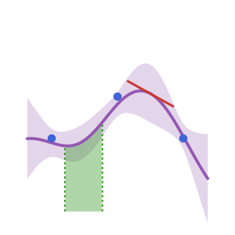

<h1 align="center">FunctionalGPs.jl</h1>

<p align="center">
  <picture align="center">
    
  </picture>
  <br>
  <strong>Mix & match point observations, derivatives and integrals for Gaussian process regression in Julia</strong>
</p>

<div align="center">
  <a href="https://timweiland.github.io/FunctionalGPs.jl/stable/"></a>
  <a href="https://timweiland.github.io/FunctionalGPs.jl/dev/"></a>
  <br>
  <a href="https://github.com/timweiland/FunctionalGPs.jl/actions/workflows/CI.yml?query=branch%3Amain"></a>
  <a href="https://codecov.io/gh/timweiland/FunctionalGPs.jl"></a>
  <a href="https://github.com/fredrikekre/Runic.jl"></a>
</div>

---

> [!WARNING]
> **Alpha release.** FunctionalGPs.jl is under active development. The public
> API is not yet stable: function names, type signatures, and module layout
> may change without notice between releases, and there are still rough edges.
> Pin a specific version if you need reproducibility, and please file an
> issue if something breaks for you — feedback at this stage is very welcome.

## What is FunctionalGPs.jl?

FunctionalGPs.jl extends [AbstractGPs.jl](https://github.com/JuliaGaussianProcesses/AbstractGPs.jl)
with a composable algebra of **linear functionals** on Gaussian processes.
You can condition a GP on, and predict, any linear transform of the latent
function:

- Point evaluations (regression as usual)
- Partial derivatives of any order (gradient / Hessian observations)
- Lebesgue integrals over intervals and boxes (Bayesian quadrature, cell averages)
- Sums, scales, tensor products, and stacks of all of the above

The functional algebra dispatches into specialised assembly paths — Toeplitz
matrices for stationary kernels on regular grids, sparse matrices for compactly
supported (Wendland) kernels, closed-form antiderivatives where available — so
you can build mixed-observation models without paying a hand-tuned-code tax.

## Installation

FunctionalGPs.jl is registered in the Julia General registry:

```julia
using Pkg
Pkg.add("FunctionalGPs")
```

## Quick start

```julia
using FunctionalGPs
using AbstractGPs

k = WendlandKernel(1, 2, 1.0)
f = GP(k)

# Condition on point observations
f1 = condition_on_observation(f, [0.0, 1.0], [0.0, 0.84]; noise = 1.0e-8)

# Further condition on a derivative observation at x = 0.5
∂x = PartialDerivative((1,))
ℒ = EvaluationFunctional([0.5]) ∘ ∂x
f2 = condition_on_observation(f1, ℒ, [1.0]; noise = 1.0e-8)
```

### Joint functional Gaussians

For Turing / DynamicPPL models that need to bundle several functionals of the
same GP and preserve their cross-covariances, use `FunctionalGaussian`:

```julia
using FunctionalGPs, FunctionalGPs.Notation

fg = FunctionalGaussian(f;
    y  = δ(X_obs),
    dy = δ(X_pred) ∘ ∂(1),
    q  = ∫([Interval(0.0, 1.0)]),
)

s    = rand(fg)             # joint prior draw as a NamedTuple (; y, dy, q)
ℓ    = loglikelihood(fg, (; y = y_obs); noise = (; y = σ²))
post = posterior(fg,    (; y = y_obs); noise = (; y = σ²))
post.dy   # LazyMvNormal over derivative locations
post.q    # LazyMvNormal over the integral
```

See the [documentation](https://timweiland.github.io/FunctionalGPs.jl/dev/) for
the full API, more examples, and the trait-based kernel specialisation system.

## Related packages

- [AbstractGPs.jl](https://github.com/JuliaGaussianProcesses/AbstractGPs.jl) — base GP interface
- [KernelFunctions.jl](https://github.com/JuliaGaussianProcesses/KernelFunctions.jl) — kernel primitives
- [GaussianMarkovRandomFields.jl](https://github.com/timweiland/GaussianMarkovRandomFields.jl) — sparse-precision GPs (used by the `vecchia` bridge)

## License

[MIT](LICENSE).
